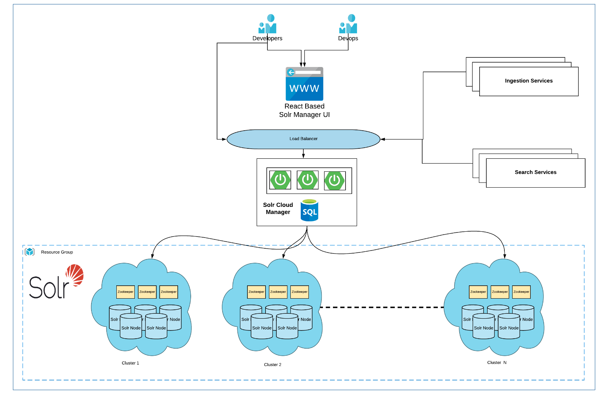
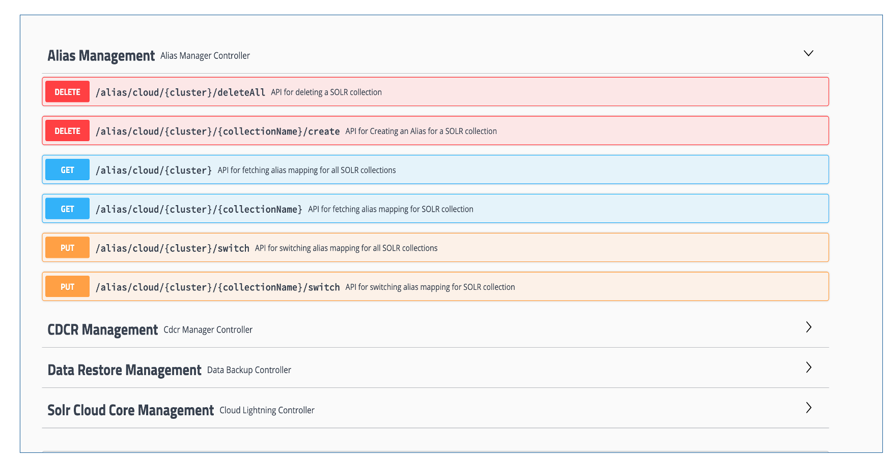

[](https://coveralls.io/github/MighTguY/Solr-Cloud-Manager?branch=master)
[](https://raw.githubusercontent.com/MighTguY/customized-symspell/master/LICENSE)
[](https://search.maven.org/search?q=g:%22io.github.mightguy%22%20AND%20a:%22solr-cloud-manager%22)


# Solr-Cloud-Manager

 

Traditionally for setting up solr with our collections, we need to manually push our configurations to zookeeper, and then we need to create collections from the collections API of SOLR.
And then we need to create aliases manually. This is a 4-5 step process and sometimes error prone to collections
of SOLR.


So here is the solr-cloud-initializer which will initialize your SOLR Cloud with pushing the fellow collections 
to the Zookeper and marking your instance up and ready for indexing.

This can also be used to update solr-configurations like adding new field and reload collections 
 
* Initialize the Solr Cloud with the configs across clusters.
* A single interface for updating/uploading any config inside zookeeper.
* Track down the CDCR changes and status.
* Trigger backup/restore and notify once completed.
* Create and manage aliases for multiple cores in a live/shadow fashion.
* A single API to switch the aliases between live/shadow.


### Design
 

### Swagger UI
 

### Prerequisites

Please make sure the collection configurations are updated in the solr-configurations module
for now only groceries and typeahead has been added to them.
To run SOLR cloud initializer it is mandatory to build solr-configurations.
so make sure your configurations are updated.

* Zk is started and chroot is created
* SolrCloud's nodes pointing to zk with chroot are started(jar with plugins should be already present there)


### Running SOLR Cloud Initializer

It's easy to run SOLR cloud initialise as it is a spring boot command line runner application,
just run  

```
java -jar solr-manager-service-1.0-SNAPSHOT.jar  
```


## Built With

* [Maven]()


## Versioning

We use [SemVer](http://semver.org/) for versioning. 

## Nexus
* [Link to Nexus-Releases](https://oss.sonatype.org/service/local/repositories/releases/content/io/github/mightguy/solr-cloud-manager/)

## Licenese

````
The MIT License (MIT)
Copyright © 2019 Lucky Sharma ( https://github.com/MighTguY/customized-symspell )
Copyright © 2018 Wolf Garbe (Original C# implementation https://github.com/wolfgarbe/SymSpell )

Permission is hereby granted, free of charge, to any person 
obtaining a copy of this software and associated documentation files
(the “Software”), to deal in the Software without restriction, 
including without limitation the rights to use, copy, modify,
merge, publish, distribute, sublicense, and/or sell copies of
the Software, and to permit persons to whom the Software is 
furnished to do so, subject to the following conditions:

The above copyright notice and this permission notice shall 
be included in all copies or substantial portions of the Software.

THE SOFTWARE IS PROVIDED “AS IS”, WITHOUT WARRANTY OF ANY KIND, 
EXPRESS OR IMPLIED, INCLUDING BUT NOT LIMITED TO THE WARRANTIES 
OF MERCHANTABILITY, FITNESS FOR A PARTICULAR PURPOSE AND NONINFRINGEMENT. 
IN NO EVENT SHALL THE AUTHORS OR COPYRIGHT HOLDERS BE LIABLE FOR ANY CLAIM, 
DAMAGES OR OTHER LIABILITY, WHETHER IN AN ACTION OF CONTRACT, TORT OR 
OTHERWISE, ARISING FROM, OUT OF OR IN CONNECTION WITH THE SOFTWARE OR 
THE USE OR OTHER DEALINGS IN THE SOFTWARE.
````

